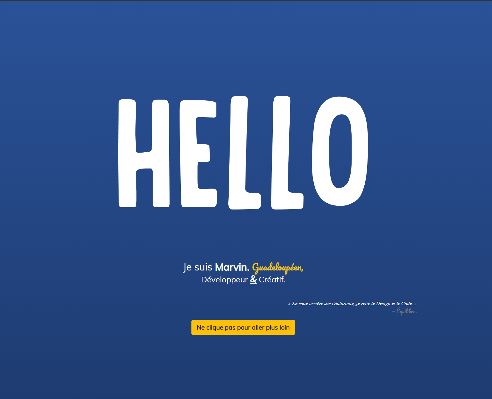
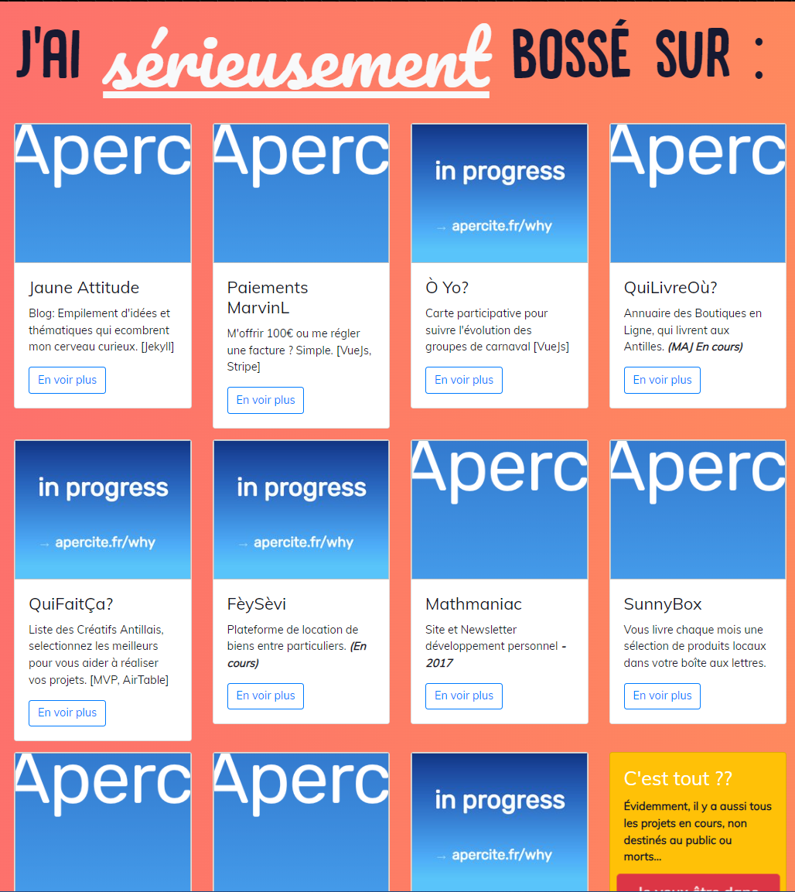

# MarvinL.com

Encore une action réalisée sur un coup de tête, "Tiens et si je retapais mon site ?"

Mon précédent site date de 2014, et n'a pas spécialement bougé depuis, c'était du html/css classique avec quelques librairies JQuery *(suis-je si vieux ?) *pour faire bouger des lettres, ou afficher des textes géants…

Même si les rares personnes à le visiter, me disaient qu'iels avaient bien rigolé en passant dessus. C'était pour moi, une vitrine périmée, la liste des projets affichée dessus pourra en témoigner :

_(L'API du service que j'utilisais pour récupérer les miniatures des sites n'a plus l'air de fonctionner)_

Je n'avais pas à l'époque, *(et n'ai toujours pas)* de stratégie d'acquisition, ni même l'envie de chercher de nouveaux clients *(on en reparlera dans un article dédié) du coup pas de grand changements à mettre en place ce sera une refonte rapide.*

## Une Refonte rapide

C'est parti, quelle techno je pourrais bien utiliser ? Je repasse sur la liste de technos que j'observais de loin sans avoir le temps de m'y pencher *(tiens ça pourrait faire l'objet d'un article ça aussi) *et Astro retiens mon attention.

Un framework orienté Contenu qui me permet d'utiliser n'importe quel autre framework UI *(react, vue…)* ? Voire même plusieurs ? En même temps ? Ok ça m'intrigue.

Tiens ils proposent des templates ? "Essentialist", ça me ressemble bien ça. 

Hop, c'est parti.

### Un peu de personnalisation

On cherche rapidement quelques couleurs et comment les associer pour que ce soit assez lisible et visuellement potable (je ne suis clairement pas un UI designer)

Le mode sombre me ressemble un peu plus d'ailleurs (team DarkMode!). T'as essayé ?\
*(je rajouterai peut-être un bouton pour changer rapidement, un de ces 4)*

Je configure le format de contenus que je compte mettre en avant ici, mes Projets et pourquoi pas un Blog où j'écrirai les articles plus "pro" & business qui me viennent dans le futur ?

J'écris quelques uns de mes derniers projets, un peu de SEO pour la forme et Boudoum!

### C'est en ligne

Sens-toi libre de me dire ce que t'en penses sur le réseau qui te plait, *(un peu la flemme d'ajouter une gestion de commentaires ici…)*

D'ailleurs je vais peut-être créer des posts pour chaque nouvel article ou projet que je publie ici ? Ça pourrait être sympathique…
